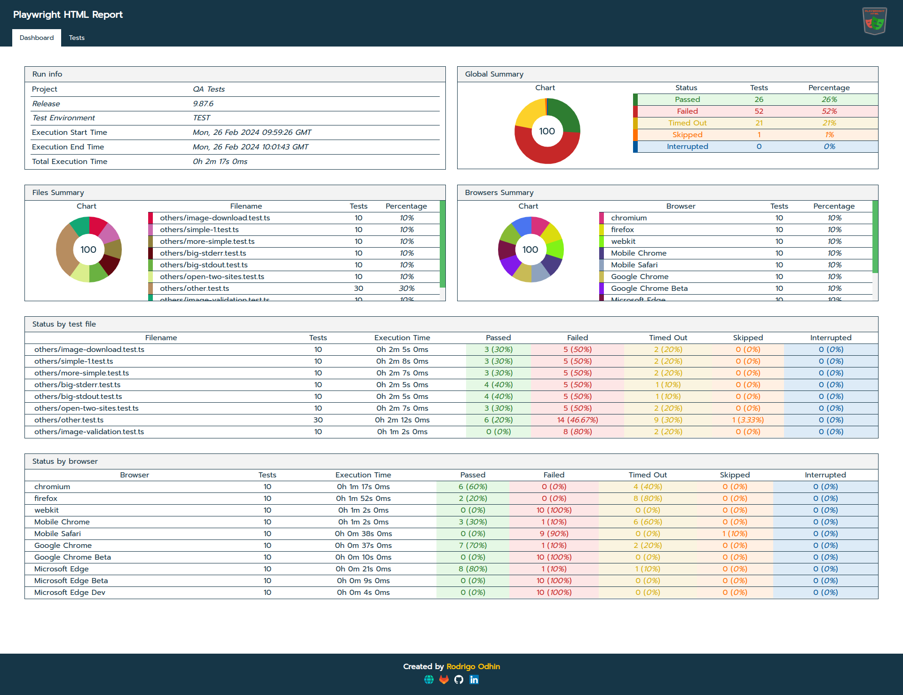
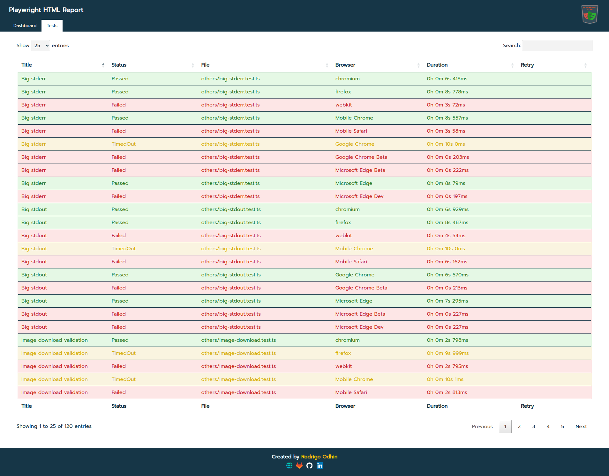
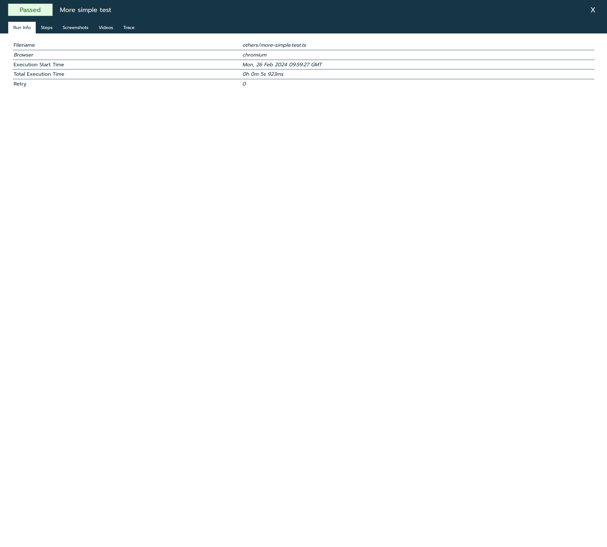
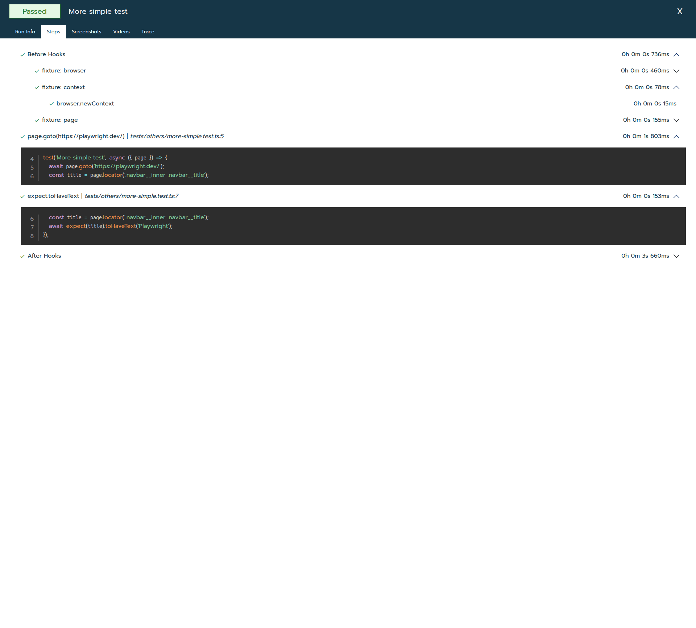
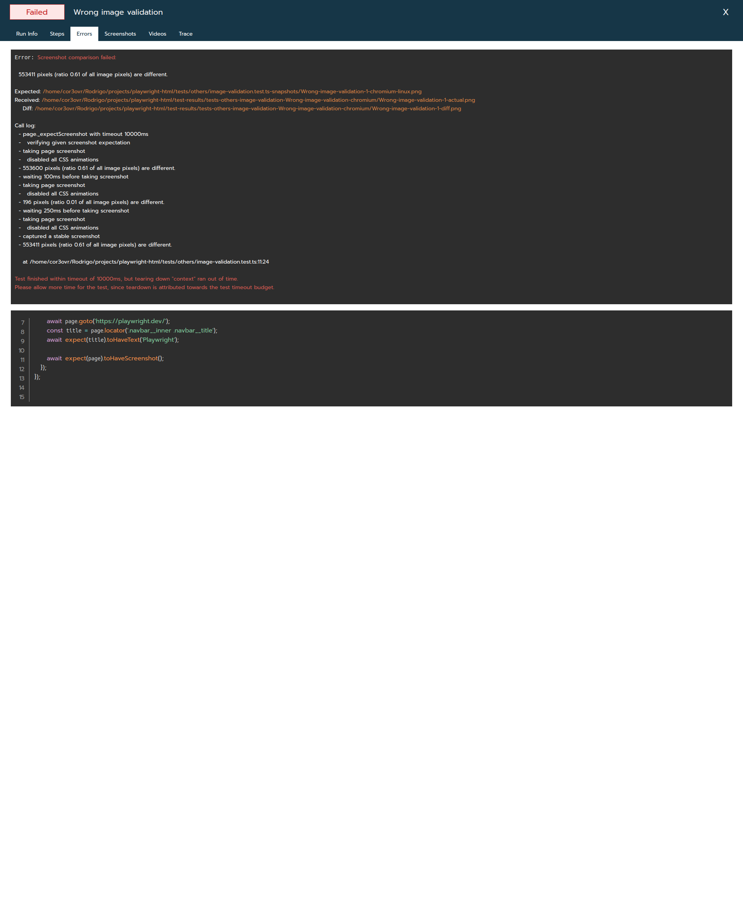
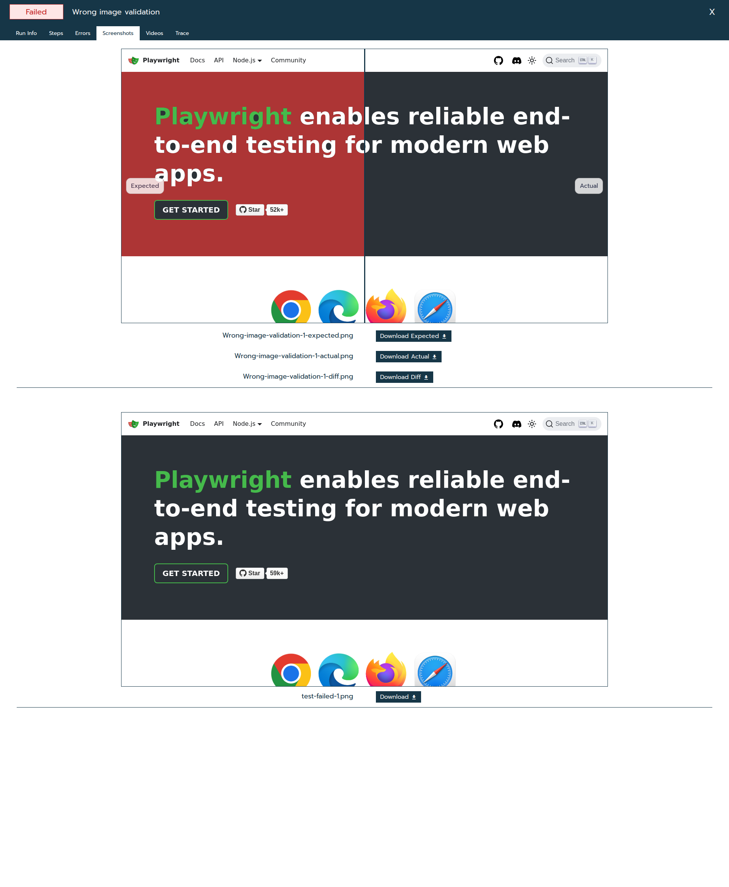
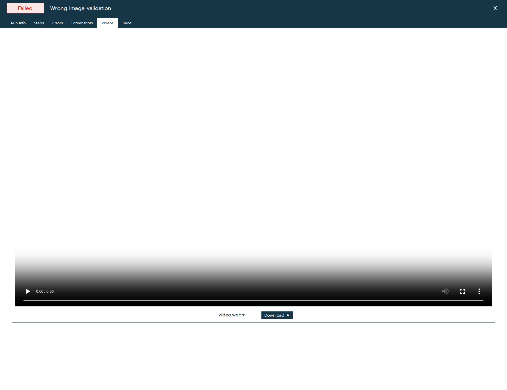
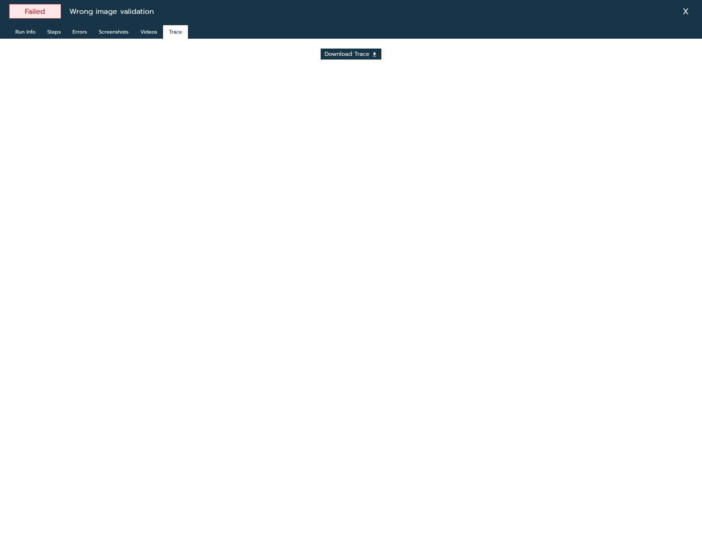
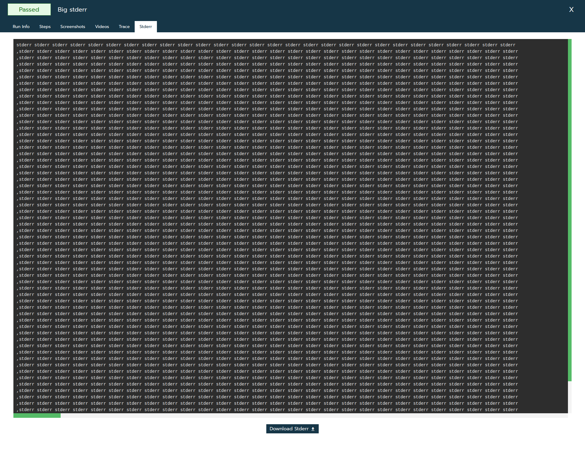

# Screenshots

### Dashboard
> 

### Test List
> 

### Test Details - Run Info
> 

### Test Details - Steps
> 

### Test Details - Run Errors
> 

### Test Details - Run Screenshots
> 

### Test Details - Run Videos
> 

### Test Details - Run Trace
> 

### Test Details - Run Stdout
> 

### Test Details - Run Stderr
> 