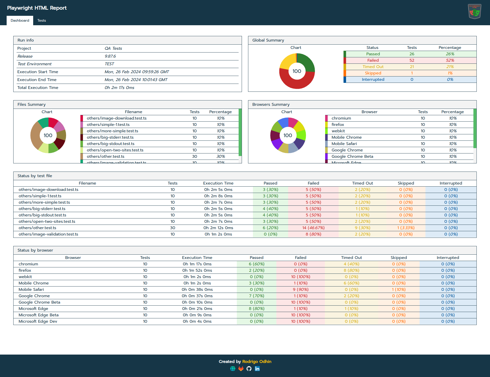
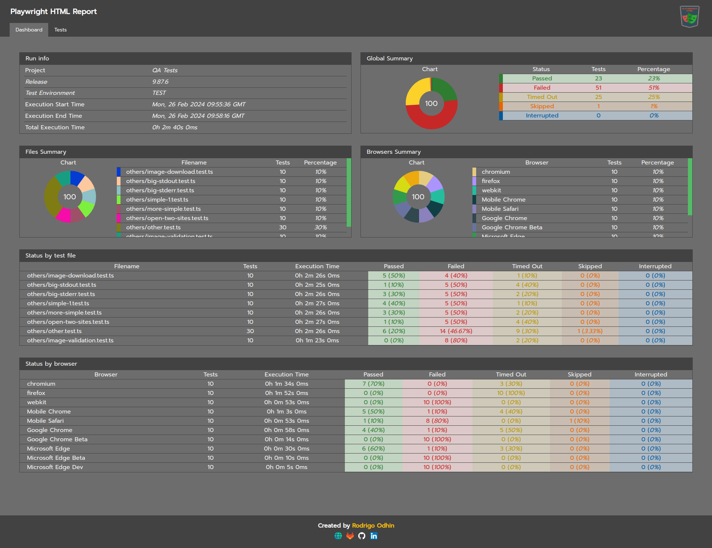
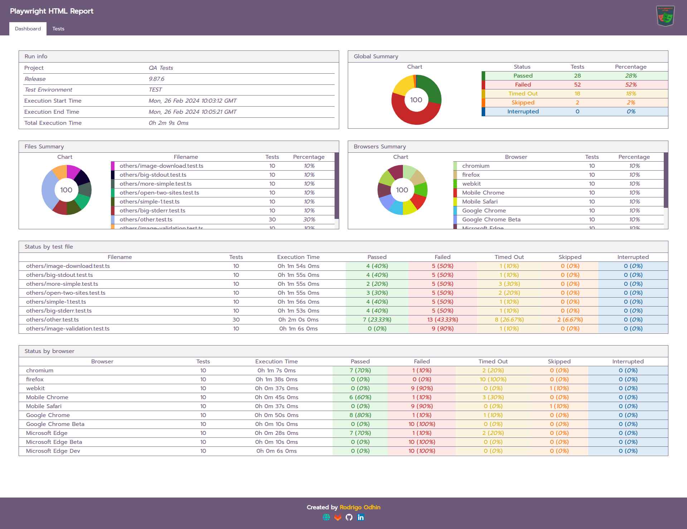

# Themes

You can change the theme of the report to get the look you prefer.
There are two default themes to choose: ```light``` and ```dark```.
If these two themes don't suit your needs, you can create a custom theme.


## Selecting a default theme

To select a theme, simply edit the ``theme`` option in the file ```playwright.config.ts``` file as below with the name of the default theme that you want to use.
If you don't select a theme, the theme ```light``` will be used.

```javascript
import { PlaywrightTestConfig } from '@playwright/test';

const config: PlaywrightTestConfig = {
  ...
  reporter: [
    ['playwright-html', { 
      theme: 'light',
    }]
    ...
  ],
}
``` 

## Selecting a custom theme

To create a custom theme, you first need to create a file with the color information, as follows.
```css
:root {
	--odhin-color-background-1: #6d597a;
	--odhin-color-background-2: #ffffff;
	--odhin-color-font-1: #f3f3f3;
	--odhin-color-font-2: #6d597a;

	--odhin-color-tab-background: #6d597a; /* Tab Background Color */
	--odhin-color-tab-font: #ffffff; /* Tab Font Color */
	--odhin-color-tab-hover-background: #ffffff; /* Tab Hover Background Color */
	--odhin-color-tab-hover-font: #6d597a; /* Tab Hover Font Color */

	--odhin-color-dashboard-card-title-background: #f3f3f3; /* Dashboard Card Title Background Color */
	--odhin-color-dashboard-card-title-font: #6d597a; /* Dashboard Card Title Font Color */
	--odhin-color-dashboard-card-title-bottom-border: #6d597a; /* Dashboard Card Title Bottom Border Color */

	--odhin-color-datatable-background: #f3f3f3; /* Tab Background Color */
	--odhin-color-datatable-font: #6d597a; /* Tab Font Color */

	--odhin-color-download-button-background: #6d597a; /* Button Background Color */
	--odhin-color-download-button-font: #f3f3f3; /* Button Font Color */
	--odhin-color-download-button-border: #6d597a; /* Button Border Color */
	--odhin-color-download-button-hover-background: #6d597a; /* Button Background Color */
	--odhin-color-download-button-hover-font: #eaac8b; /* Button Font Color */
	--odhin-color-download-button-hover-border: #eaac8b; /* Button Border Color */

	--odhin-color-close-button-background: #6d597a; /* Button Background Color */
	--odhin-color-close-button-font: #f3f3f3; /* Button Font Color */
	--odhin-color-close-button-border: #6d597a; /* Button Border Color */
	--odhin-color-close-button-hover-background: #6d597a; /* Button Background Color */
	--odhin-color-close-button-hover-font: #eaac8b; /* Button Font Color */
	--odhin-color-close-button-hover-border: #eaac8b; /* Button Border Color */

	--odhin-color-main-tests-table-border: #6d597a; /* Main Tests Table Border Color */
	--odhin-color-others-borders: #6d597a; /* Others Borders Color */

	--odhin-color-scrollbar-thumb: #6d597a; /* Scrollbar Thumb Color */
	--odhin-color-scrollbar-track: #f3f3f3; /* Scrollbar Track Color */
	
	--odhin-color-selection-background: #6d597a; /* Selection Background Color */
	--odhin-color-selection-font: #f3f3f3; /* Selection Font Color */

	--odhin-passed-status-color: #2e7d31;
	--odhin-failed-status-color: #c62828;
	--odhin-timedOut-status-color: #d6ad0a;
	--odhin-skipped-status-color: #ff6f00;
	--odhin-interrupted-status-color: #01579b;

	--odhin-light-passed-status-color: #e5f8e5;
	--odhin-light-failed-status-color: #fde6e6;
	--odhin-light-timedOut-status-color: #faf4e0;
	--odhin-light-skipped-status-color: #fff0e3;
	--odhin-light-interrupted-status-color: #ddebf7;
}
```

After creating the theme file, simply edit the ``theme`` option in the file ```playwright.config.ts``` file as below with the path of the custom theme file you created earlier.

```javascript
import { PlaywrightTestConfig } from '@playwright/test';

const config: PlaywrightTestConfig = {
  ...
  reporter: [
    ['playwright-html', { 
        theme: 'theme/custom-theme.css',
    }]
    ...
  ],
}
```

## Examples
### light
> 

### dark
> 

### custom
> 